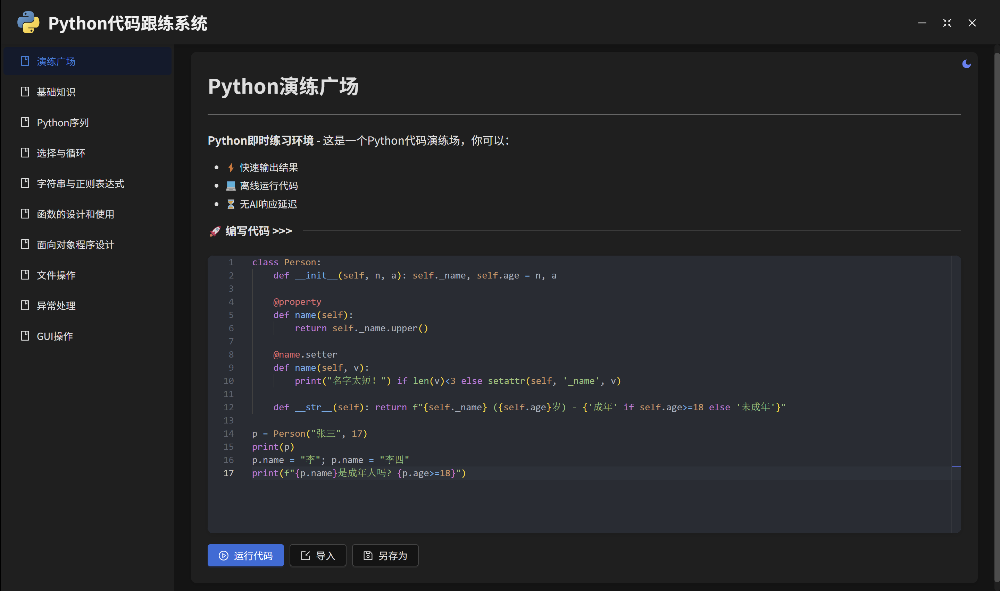
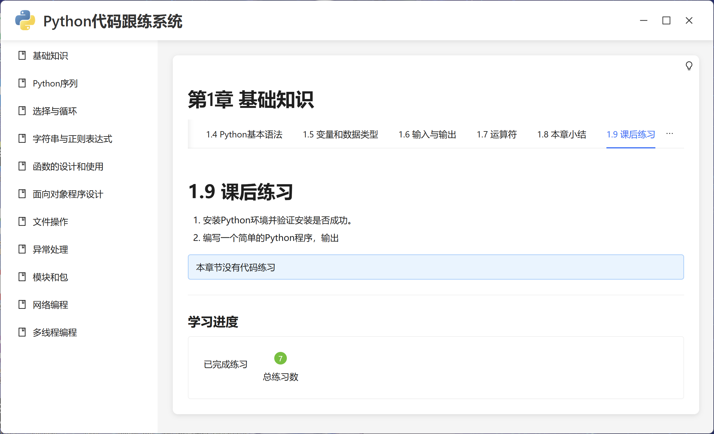
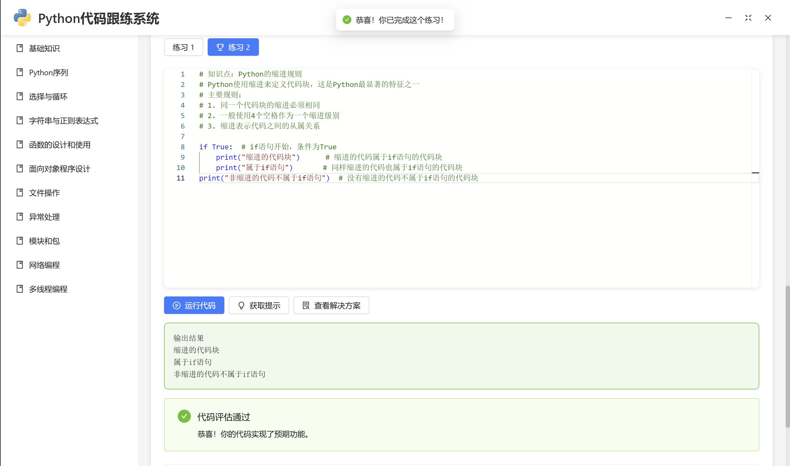
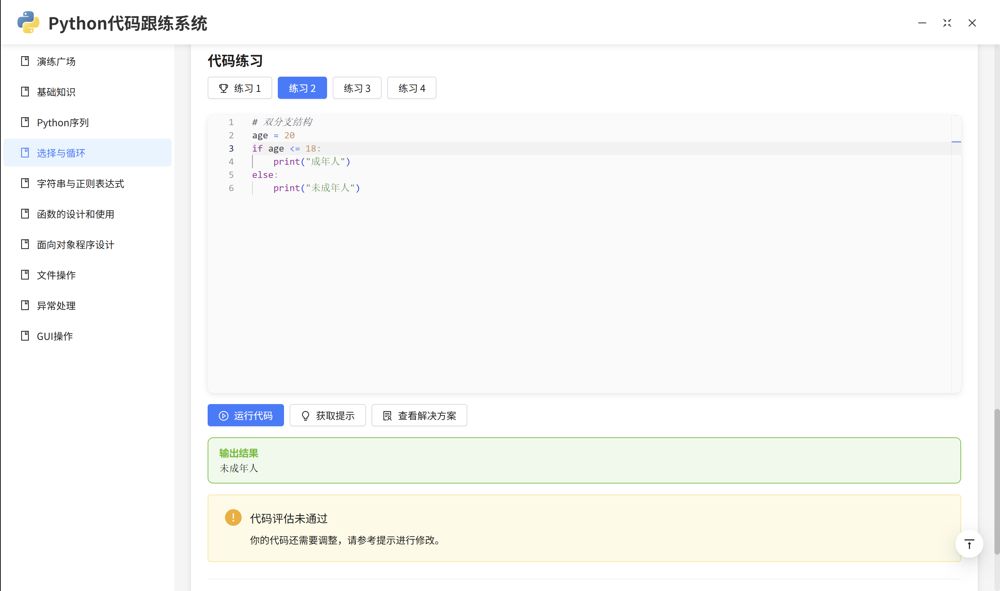
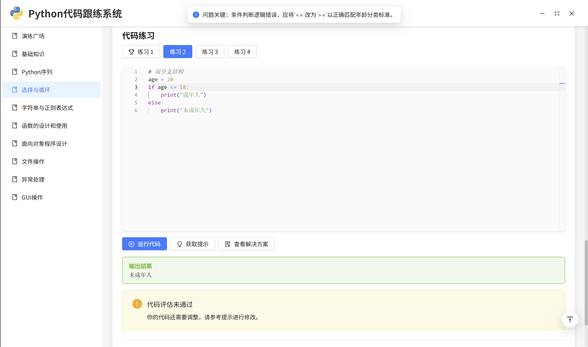
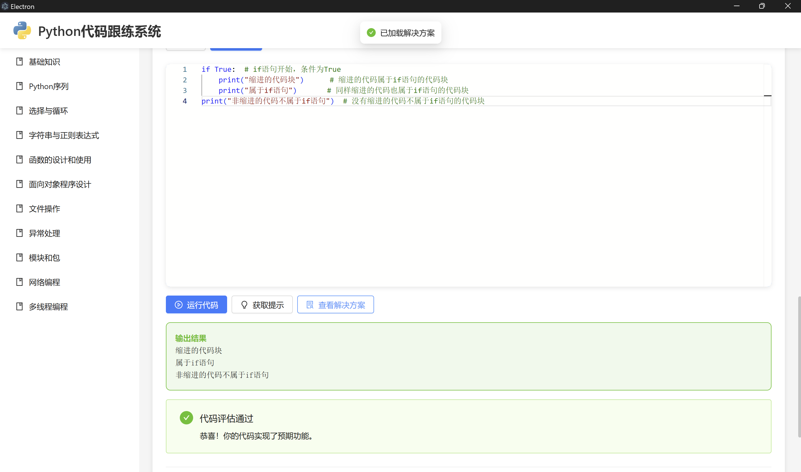

# Python学习跟踪系统

   

**Python学习跟踪系统**是一个集成代码练习与AI助手的知识管理跨平台桌面应用，结合Electron的桌面能力与Python的计算能力，提供沉浸式学习体验。

## 🚀 核心特性

### 智能学习引擎
- **实时代码执行**：支持代码片段即时运行，以及是否达到任务要求的练习评估
- **错误诊断**：Deepseek智能语法检查与错误提示
- **学习进度跟踪**：自动记录练习完成情况

### 跨进程通信
- **双向IPC通道**：主进程与渲染进程高效通信
- **Python Shell集成**：安全执行系统级Python命令
- **进程状态监控**：实时显示Python服务运行状态

### 知识管理体系
- **Markdown笔记**：支持GFM标准语法
- **学习资源管理**：章节化知识库结构

## 📸 页面截图展示

###  主题切换

| 暗色主题                         | 亮色主题                           |
|-------------------------------------|--------------------------------|
|  |  |

### 代码运行

| 运行正确                         | 需要调整                           |
|-------------------------------------|--------------------------------|
|  |  |

### 获取提示与解决方案
| 获取提示                         | 解决方案                           |
|-------------------------------------|--------------------------------|
|  |  |

## 🛠 技术架构

| 层级         | 技术组件                                                |
| ------------ | ------------------------------------------------------- |
| **桌面层**   | Electron 35 + Node.js                                   |
| **渲染层**   | React 18 + Ant Design 5 + Monaco Editor                 |
| **服务层**   | Python 3.11 + DeepSeek Chat API                         |
| **通信层**   | IPC Main/Renderer + Python Shell                        |
| **构建工具** | Vite 6 + electron-vite / electron-builder + PyInstaller |

## 📂 项目结构

```
python-track/
├── src/                  # 跨进程架构
│   ├── main/             # Electron主进程（Node.js）
│   ├── preload/          # 预加载脚本
│   │   └── ipc_bridge.js # IPC通信桥接
│   └── renderer/         # React应用（Web技术）
│       ├── api/          # API接口
│       ├── assets/       # 静态资源
│       ├── components/   # 可视化组件
│       └── pages/        # 页面组件
│
├── python-server/        # Python服务端
│   ├── api_server.py     # RESTful API服务
│   ├── ai_helper.py      # AI助手实现
│   ├── ipc_server.py     # IPC通信服务
│   └── notes/            # Markdown教程文件
│       ├── chapter01.md  # 基础知识
│       ├── chapter02.md  # Python序列
│       └── ...           # 其他章节
│
├── resources/            # 应用资源
│   └── python_ipc_server.exe # 打包后的Python服务
│
└── imgs/                 # 应用截图
    └── screenshot*.png   # 界面截图
```

## 🛠️ 开发准备

### 环境要求
- Node.js ≥18.0
- Python ≥3.10
- electron-rebuild

### 启动开发环境
```bash
# 打包Python服务（新终端）
cd python-server
.\build_exe.bat.bat

# 安装依赖
npm install

# 启动Electron开发模式
npm run dev

# 启动Electron构建打包
npm run build:win

npm run build:linux

npm run build:mac

# 检查build后的dist/win-unpacked/resources是否存在python_ipc_server.exe

dir /s /b "dist\win-unpacked\resources\python_ipc_server.exe"

# 不存在把根目录的resources目录的python_ipc_server.exe移动到dist/win-unpacked/resources

mkdir "dist\win-unpacked\resources" 2>nul & move /Y "resources\python_ipc_server.exe" "dist\win-unpacked\resources\"
```

## 🤝 贡献指南

欢迎通过GitHub提交PR：
1. 创建特性分支 (`git checkout -b feature/新特性`)
2. 添加单元测试
3. 更新文档说明
4. 提交Pull Request

## 📜 开源协议

[MIT License](LICENSE)

---

**让学习可视化，让进步可量化** 🚀 欢迎提出Issue ✨
