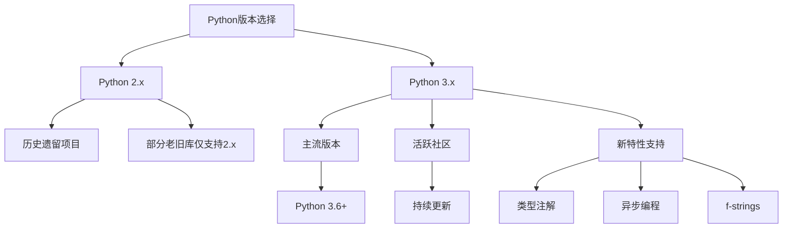
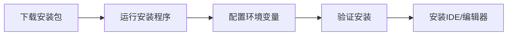
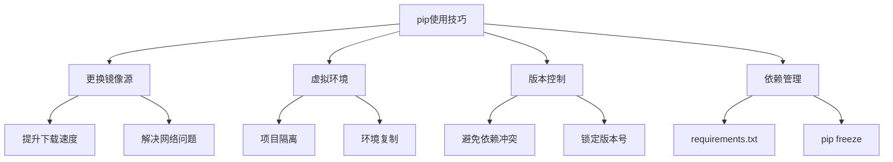
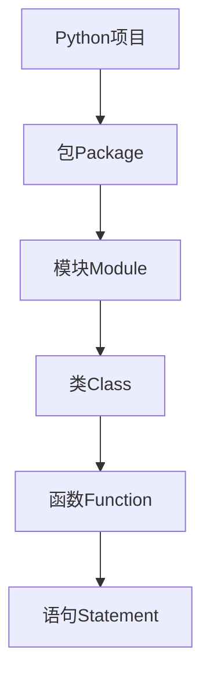

# 第1章 Python基础知识

## 1.1 Python版本选择

### 版本特点对比



Python版本选择是学习和开发过程中的第一个重要决策：

- **Python 2.x**：已于2020年1月1日停止官方支持
  - 仅适用于维护历史遗留项目
  - 某些特定领域的老旧库可能仅支持2.x
  - 不再获得安全更新和bug修复

- **Python 3.x**：当前的主流版本
  - 拥有活跃的社区支持和持续的更新
  - 提供现代化的语言特性，如类型注解、异步编程和f-strings
  - 所有新项目都应使用Python 3.x
  - 推荐使用Python 3.6+版本，以获得最新的语言特性

| 特性 | Python 2.x | Python 3.x |
|------|------------|------------|
| 维护状态 | 已停止维护 | 活跃维护 |
| 社区支持 | 减少 | 活跃 |
| 新特性 | 无 | 持续更新 |
| 库支持 | 历史库 | 最新库 |
| 学习建议 | 特殊需求 | 推荐学习 |

## 1.2 Python环境搭建

### 安装流程



### 开发环境选择

| 工具类型 | 推荐选择 | 适用场景 |
|----------|----------|----------|
| 集成IDE | PyCharm | 大型项目开发 |
| 轻量编辑器 | VSCode | 日常开发 |
| 默认IDE | IDLE | 学习与简单开发 |
| 在线环境 | Jupyter | 数据分析、教学 |

## 1.3 包管理工具pip

### 常用pip命令

```bash
# 安装包
pip install package_name

# 指定版本安装
pip install package_name==1.0.4

# 批量安装
pip install -r requirements.txt

# 升级包
pip install --upgrade package_name

# 卸载包
pip uninstall package_name

# 查看已安装包
pip list
```

### 使用技巧



使用pip进行包管理时，掌握以下技巧可以显著提高开发效率：

- **更换镜像源**：默认的PyPI源在国内访问可能较慢
  - 临时使用：`pip install package -i https://pypi.tuna.tsinghua.edu.cn/simple`
  - 永久配置：`pip config set global.index-url https://pypi.tuna.tsinghua.edu.cn/simple`
  - 常用国内镜像：清华源、阿里云源、中科大源等
  - 可解决下载速度慢和网络连接问题

- **虚拟环境**：隔离不同项目的依赖，避免版本冲突
  - 创建：`python -m venv myenv` 或 `virtualenv myenv`
  - 激活：Windows下 `myenv\Scripts\activate`，Linux/Mac下 `source myenv/bin/activate`
  - 可以为每个项目创建独立的环境，便于环境复制和项目移植

- **版本控制**：精确控制包的版本
  - 指定版本：`pip install package==1.0.4`
  - 版本范围：`pip install package>=1.0.4,<2.0.0`
  - 锁定版本可以确保开发、测试和生产环境的一致性

- **依赖管理**：管理项目依赖
  - 导出依赖：`pip freeze > requirements.txt`
  - 安装依赖：`pip install -r requirements.txt`
  - 便于项目共享和部署，确保环境一致性

## 1.4 Python基础概念

### 1.4.1 Python对象模型

Python的对象模型是其核心特性之一，在Python中，一切皆为对象。这种统一的对象系统为Python提供了极大的灵活性和一致性：

### 对象的基本属性

- **对象标识（id）**：每个对象都有唯一的标识符，可通过`id()`函数获取，代表对象在内存中的地址
- **对象类型（type）**：定义了对象的行为和支持的操作，可通过`type()`函数获取
- **对象值（value）**：对象存储的实际数据
- **属性字典（__dict__）**：存储对象的属性和方法
- **类引用（__class__）**：指向对象所属的类

### 对象的层次结构

- **基础对象**：所有Python对象都继承自`object`类
- **数值类型**：包括整数（int）、浮点数（float）和复数（complex）
- **序列类型**：有序的集合，支持索引和切片操作
  - 字符串（str）：不可变的Unicode字符序列
  - 列表（list）：可变的异构元素序列
  - 元组（tuple）：不可变的异构元素序列
- **映射类型**：键值对集合
  - 字典（dict）：可变的键值映射，提供O(1)时间复杂度的查找

### 对象的特性

- **可变性**：对象创建后是否可以修改
  - 可变对象：列表、字典、集合等
  - 不可变对象：数字、字符串、元组等
- **引用语义**：Python中的变量是对象的引用，而不是对象本身
- **垃圾回收**：Python自动管理内存，当对象不再被引用时回收其内存

这种统一的对象模型使得Python代码更加一致和灵活，同时也是Python动态特性的基础。

Python的对象模型是其核心特性之一，在Python中，一切皆为对象：

- **对象标识（id）**：每个对象都有唯一的标识符，可通过`id()`函数获取
- **对象类型（type）**：定义了对象的行为和支持的操作，可通过`type()`函数获取
- **对象值（value）**：对象存储的实际数据

所有Python对象都继承自基础对象类型，包括数字、字符串、列表等。这种统一的对象模型使得Python代码更加一致和灵活。

### 1.4.2 变量与数据类型

```python
# 变量定义与赋值
name = "Python"  # 字符串
age = 30         # 整数
pi = 3.14       # 浮点数
is_active = True # 布尔值
complex_num = 1 + 2j  # 复数

# 动态类型示例
x = 100       # x是整数
x = "hello"   # x变为字符串
x = [1, 2, 3] # x变为列表
```

### 1.4.3 运算符

| 类型 | 运算符 | 示例 |
|------|--------|------|
| 算术运算符 | +, -, *, /, //, %, ** | a + b |
| 比较运算符 | ==, !=, <, >, <=, >= | a > b |
| 逻辑运算符 | and, or, not | a and b |
| 位运算符 | &, \|, ^, ~, <<, >> | a & b |
| 成员运算符 | in, not in | a in list |
| 身份运算符 | is, is not | a is b |

### 1.4.4 代码规范

```python
# 命名规范示例
class MyClass:           # 类名使用驼峰命名
    def my_method(self): # 方法名使用下划线
        pass

MAX_VALUE = 100         # 常量使用大写
user_name = "Python"    # 变量使用下划线
```

## 1.5 Python程序结构

### 文件类型

Python开发中会遇到多种类型的文件，每种类型都有其特定的用途和特点：

| 扩展名 | 用途 | 说明 | 使用场景 |
|--------|------|------|----------|
| .py | 源代码文件 | 主要程序文件 | - 存放Python源代码<br>- 可直接运行和编辑<br>- 最常用的文件类型 |
| .pyw | 窗口程序 | 无控制台窗口 | - GUI应用程序<br>- 不需要命令行交互<br>- Windows系统专用 |
| .pyc | 字节码文件 | 编译后文件 | - Python解释器自动生成<br>- 提高程序启动速度<br>- 不需要手动创建 |
| .pyd | 动态链接库 | 扩展模块 | - C/C++编写的Python扩展<br>- 高性能模块<br>- 系统级功能扩展 |

#### 详细说明

1. **.py文件**
   - Python的标准源代码文件
   - 包含可读的Python代码
   - 可以使用任何文本编辑器编辑
   - 执行时由Python解释器实时编译

2. **.pyw文件**
   - 专门用于Windows系统的Python脚本
   - 运行时不会显示控制台窗口
   - 适合开发GUI应用程序
   - 其他方面与.py文件完全相同

3. **.pyc文件**
   - Python解释器自动生成的字节码文件
   - 存储编译后的字节码，加快程序启动
   - 通常位于`__pycache__`目录下
   - 不同Python版本的字节码文件不兼容

4. **.pyd文件**
   - Windows平台上的Python动态链接库
   - 通常由C/C++编写并编译
   - 用于提供高性能的扩展模块
   - 可以直接被Python代码导入使用

### 模块组织



Python代码组织遵循层次化结构，从大到小依次为：

#### 1. 项目（Project）
- 完整的应用程序或库，包含多个相关的包
- 通常包含以下文件：
  - `README.md`：项目说明文档
  - `requirements.txt`：依赖包列表
  - `setup.py`：安装配置文件
  - `.gitignore`：版本控制忽略文件

#### 2. 包（Package）
- 含有`__init__.py`文件的目录，用于组织相关模块
- 包的作用：
  - 避免模块名冲突
  - 提供命名空间
  - 组织相关模块

```tree
my_project/
    ├── my_package/
    │   ├── __init__.py
    │   ├── module1.py
    │   └── module2.py
    ├── tests/
    │   └── test_module1.py
    ├── README.md
    └── requirements.txt
```

#### 3. 模块（Module）
- 单个Python文件（.py），包含变量、函数和类定义
- 模块的特点：
  - 代码复用的基本单位
  - 提供命名空间，避免名称冲突
  - 可以被其他模块导入

```python
# module1.py
def greet(name):
    return f"Hello, {name}!"

class Person:
    def __init__(self, name):
        self.name = name

# 在其他模块中使用
from my_package.module1 import greet, Person
```

#### 4. 类（Class）
- 对象的蓝图，封装数据和行为
- 类的组成：
  - 属性：对象的数据
  - 方法：对象的行为
  - 构造函数：初始化对象

```python
class Student:
    def __init__(self, name, age):
        self.name = name  # 属性
        self.age = age

    def study(self):     # 方法
        return f"{self.name} is studying"
```

#### 5. 函数（Function）
- 执行特定任务的代码块
- 函数的特点：
  - 代码复用
  - 参数传递
  - 返回值
  - 作用域隔离

```python
def calculate_average(numbers):
    if not numbers:  # 参数验证
        return 0
    return sum(numbers) / len(numbers)  # 返回值
```

#### 6. 语句（Statement）
- 执行操作的单个指令
- 常见语句类型：
  - 赋值语句
  - 条件语句
  - 循环语句
  - 导入语句

```python
# 赋值语句
x = 10

# 条件语句
if x > 0:
    print("Positive")

# 循环语句
for i in range(x):
    print(i)

# 导入语句
import math
```

这种层次结构使得Python代码组织清晰，便于维护和扩展。通过导入机制，可以在不同模块间共享代码，提高代码复用性。每个层次都有其特定的职责和作用，共同构成了一个完整的Python应用程序。

## 1.6 快速入门示例

### 基础程序示例

#### 1. 输入输出示例
```python
# 基本输入输出
name = input("请输入你的名字：")  # input()函数获取用户输入
print(f"你好，{name}！")         # f-string格式化输出

# 格式化输出的多种方式
age = 25
height = 1.75
# 使用f-string（推荐）
print(f"年龄：{age}岁，身高：{height}米")
# 使用format()方法
print("年龄：{}岁，身高：{}米".format(age, height))
# 使用%运算符
print("年龄：%d岁，身高：%.2f米" % (age, height))
```

#### 2. 数字处理示例
```python
# 获取一个三位数的各个位数
num = input("请输入一个三位数：")
digits = list(map(int, num))  # 将字符串转换为整数列表

# 方法一：使用列表索引
print(f"百位：{digits[0]}")
print(f"十位：{digits[1]}")
print(f"个位：{digits[2]}")

# 方法二：使用整数运算
num = int(num)
print(f"百位：{num // 100}")
print(f"十位：{num % 100 // 10}")
print(f"个位：{num % 10}")
```

#### 3. 数学运算示例
```python
# 基本算术运算
a = 10
b = 20

# 四则运算
print(f"加法：{a} + {b} = {a + b}")  # 加法
print(f"减法：{a} - {b} = {a - b}")  # 减法
print(f"乘法：{a} * {b} = {a * b}")  # 乘法
print(f"除法：{a} / {b} = {a / b}")  # 除法（浮点数结果）

# 高级运算
print(f"整除：{a} // {b} = {a // b}")  # 整除（向下取整）
print(f"取余：{a} % {b} = {a % b}")    # 取余
print(f"幂运算：{a} ** 2 = {a ** 2}")   # 幂运算

# 数学函数（需要导入math模块）
import math

print(f"绝对值：abs(-10) = {abs(-10)}")
print(f"四舍五入：round(3.7) = {round(3.7)}")
print(f"向上取整：math.ceil(3.2) = {math.ceil(3.2)}")
print(f"向下取整：math.floor(3.8) = {math.floor(3.8)}")
```

#### 4. 字符串处理示例
```python
# 字符串基本操作
text = "Hello, Python!"

# 字符串长度
print(f"字符串长度：{len(text)}")

# 字符串索引和切片
print(f"第一个字符：{text[0]}")
print(f"最后一个字符：{text[-1]}")
print(f"前五个字符：{text[:5]}")
print(f"后六个字符：{text[-6:]}")

# 字符串方法
print(f"大写：{text.upper()}")
print(f"小写：{text.lower()}")
print(f"首字母大写：{text.capitalize()}")
print(f"单词首字母大写：{text.title()}")

# 字符串查找和替换
print(f"查找'Python'的位置：{text.find('Python')}")
print(f"替换后的字符串：{text.replace('Python', 'World')}")
```

## 1.7 Python之禅

### 核心理念

| 原则 | 说明 |
|------|------|
| 简单胜于复杂 | 代码应该简单直观 |
| 明确胜于隐晦 | 代码意图应该清晰 |
| 扁平胜于嵌套 | 避免过度嵌套 |
| 可读性很重要 | 代码应该易于理解 |
| 错误不应被静默 | 异常应该被处理 |
| 显式优于隐式 | 明确表达意图 |
