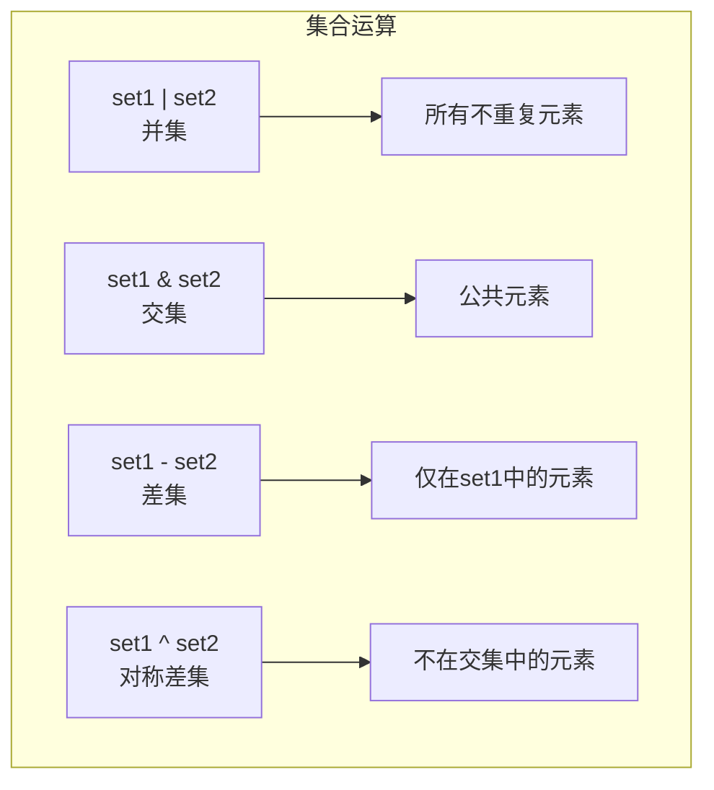

# 第2章 Python序列

## 2.1 序列概述

序列是Python中最基础和最重要的数据结构之一。它是一种有序的集合类型，可以存储多个不同类型的数据。理解序列的特性和使用场景对于Python编程至关重要。

序列在Python中扮演着核心角色，它提供了一种组织和管理数据的标准方式。通过序列，我们可以将相关的数据组织在一起，并通过统一的接口进行访问和操作。序列的灵活性使其成为Python中最常用的数据结构之一，它可以存储任何类型的数据，包括数字、字符串、对象，甚至其他序列。

### Python序列类型分类

Python中的序列是一种有序的元素集合，是最基本也是最常用的数据结构之一。序列可以根据可变性分为两大类：

- **可变序列**：创建后可以修改其内容

  - 列表（list）：最常用的序列类型，可存储不同类型的元素
  - 字典（dict）：键值对映射，通过键快速访问值
  - 集合（set）：无序不重复元素的集合，支持集合运算
- **不可变序列**：创建后不能修改其内容

  - 元组（tuple）：类似列表但不可修改，常用于多值返回
  - 字符串（str）：文本序列，提供丰富的文本处理方法
  - 冻结集合（frozenset）：不可变的集合，可作为字典的键

选择合适的序列类型对程序效率和代码质量有重要影响。

### 序列特点对比

| 序列类型 | 可变性 | 有序性 | 元素唯一性 | 索引访问 | 常用场景   |
| -------- | ------ | ------ | ---------- | -------- | ---------- |
| 列表     | 可变   | 有序   | 允许重复   | 支持     | 数据集合   |
| 元组     | 不可变 | 有序   | 允许重复   | 支持     | 固定数据   |
| 字典     | 可变   | 无序   | 键唯一     | 键访问   | 映射关系   |
| 集合     | 可变   | 无序   | 元素唯一   | 不支持   | 去重、运算 |

## 2.2 列表

列表（List）是Python中最常用的数据结构之一，它的灵活性和易用性使其成为Python程序员最常用的工具之一。列表可以存储任意类型的数据，并且可以根据需要动态地调整大小，这使得它特别适合用于处理动态数据集合。

列表具有以下特点：

1. **可变性**：列表是可变序列，可以随时添加、删除或修改元素
2. **有序性**：列表中的元素保持插入顺序，可以通过索引访问
3. **异构性**：列表可以存储不同类型的数据（整数、字符串、对象等）
4. **动态性**：列表的大小可以动态改变

### 列表操作

```python
# 列表创建
fruits = ['apple', 'banana', 'orange']
numbers = list(range(1, 6))  # [1, 2, 3, 4, 5]

# 列表访问和切片
print(fruits[0])       # 第一个元素
print(fruits[-1])      # 最后一个元素
print(fruits[1:3])     # 切片获取子列表

# 列表修改
fruits[1] = 'grape'    # 修改元素
fruits.append('pear')  # 添加元素
fruits.extend(['kiwi', 'mango'])  # 扩展列表
fruits.insert(1, 'lemon')  # 插入元素

# 列表删除
fruits.remove('apple')  # 删除指定元素
popped = fruits.pop()   # 弹出最后一个元素
del fruits[0]          # 删除指定位置元素

# 列表方法
print(len(fruits))     # 列表长度
print(fruits.count('apple'))  # 元素出现次数
fruits.sort()          # 排序
fruits.reverse()       # 反转
```

### 列表推导式

```python
# 基本列表推导式
squares = [x**2 for x in range(10)]  # 0到9的平方

# 带条件的列表推导式
even_squares = [x**2 for x in range(10) if x % 2 == 0]  # 偶数的平方

# 多重循环的列表推导式
matrix = [(i, j) for i in range(2) for j in range(2)]

# 嵌套列表推导式
matrix = [[1, 2, 3], [4, 5, 6], [7, 8, 9]]
transposed = [[row[i] for row in matrix] for i in range(3)]
```

## 2.3 元组

元组（Tuple）是Python中的不可变序列，它与列表类似，但一旦创建就不能修改。这种不可变性使得元组成为存储固定数据集的理想选择，同时也使其在某些场景下比列表更加高效和安全。

元组具有以下特点：

1. **不可变性**：创建后不能修改、添加或删除元素
2. **有序性**：元素保持固定顺序，可以通过索引访问
3. **效率高**：相比列表，元组的创建和访问速度更快
4. **安全性**：数据不会被意外修改

### 元组操作

```python
# 元组创建
point = (3, 4)
singleton = (42,)  # 单元素元组需要逗号
empty = ()

# 元组解包
x, y = point
a, b, c = 1, 2, 3

# 元组方法
coords = (1, 2, 2, 3, 2)
print(coords.count(2))  # 统计元素出现次数
print(coords.index(3))  # 查找元素位置
```

## 2.4 字典

字典是Python中一种可变的、无序的键值对（key-value）集合数据类型，用大括号 `{}` 表示，是Python中唯一的映射类型（mapping type）。字典通过键值对的方式组织数据，这种结构使得数据的存储和检索都非常高效。

#### 1. 字典创建与初始化

```python
# 方法1：字面量创建
person = {
    'name': '张三',
    'age': 25,
    'city': '北京',
    'is_student': False
}

# 方法2：dict()构造函数
empty_dict = dict()  # 创建空字典
person2 = dict(name='李四', age=30)  # 关键字参数创建

# 方法3：从键值对序列创建
coordinates = dict([('x', 10), ('y', 20), ('z', 30)])

# 方法4：字典推导式
squares = {x: x**2 for x in range(1, 6)}  # {1: 1, 2: 4, ..., 5: 25}
```

#### 2. 字典遍历

```python
# 重新初始化字典
inventory = {
    'apples': 30,
    'bananas': 45,
    'oranges': 25,
    'pears': 15
}

print("\n=== 字典遍历 ===")

# 方法1：遍历键
print("\n遍历键:")
for key in inventory:
    print(f"商品: {key}")

# 方法2：遍历键值对
print("\n遍历键值对:")
for item, quantity in inventory.items():
    print(f"{item}: {quantity}件")

# 方法3：同时遍历索引和键
print("\n带索引的遍历:")
for idx, key in enumerate(inventory):
    print(f"{idx+1}. {key}: {inventory[key]}")

# 方法4：只遍历值
print("\n遍历值:")
total = sum(inventory.values())
print(f"总库存量: {total}")
```

#### 3. 字典高级操作

```python
# 4.1 字典合并（Python 3.9+）
print("\n=== 字典合并 ===")
default_settings = {'color': 'red', 'size': 'medium'}
user_settings = {'size': 'large', 'opacity': 0.8}

# 方法1：update()
combined = default_settings.copy()
combined.update(user_settings)
print("合并结果1:", combined)

# 方法2：| 运算符（Python 3.9+）
combined = default_settings | user_settings
print("合并结果2:", combined)

# 4.2 嵌套字典
print("\n=== 嵌套字典 ===")
school = {
    'class1': {
        'teacher': '张老师',
        'students': 45
    },
    'class2': {
        'teacher': '李老师',
        'students': 38
    }
}

# 访问嵌套值
print("class1老师:", school['class1']['teacher'])

# 修改嵌套值
school['class2']['students'] += 2
print("更新后class2人数:", school['class2']['students'])

# 4.3 字典排序
print("\n=== 字典排序 ===")
scores = {'Alice': 88, 'Bob': 76, 'Charlie': 92, 'David': 85}

# 按键排序
print("按键排序:", dict(sorted(scores.items())))

# 按值排序（降序）
print("按值排序:", dict(sorted(scores.items(), key=lambda x: x[1], reverse=True)))
```

### 4.字典基本操作示例

```python
# 创建基础字典
student = {
    'name': '王五',
    'age': 22,
    'major': '计算机科学'
}

# 2.1 添加/修改元素
print("=== 添加/修改操作 ===")
student['email'] = 'wangwu@university.edu'  # 添加新键值对
student['age'] = 23  # 修改已有键值对
student.update({
    'phone': '13800138000',
    'address': '上海市浦东新区'
})  # 批量更新

# 设置默认值（仅当键不存在时）
student.setdefault('gender', '男')
student.setdefault('age', 24)  # 不会改变已有值

print("当前学生信息:", student)

# 2.2 访问元素
print("\n=== 访问操作 ===")
print("直接访问:", student['name'])  # 王五
print("安全访问:", student.get('hobby', '无'))  # 返回默认值'无'

# 获取所有键、值、键值对
print("所有键:", list(student.keys()))
print("所有值:", list(student.values()))
print("键值对:", list(student.items()))

# 2.3 删除元素
print("\n=== 删除操作 ===")
removed_value = student.pop('phone')  # 删除并返回值
print(f"已删除电话号码: {removed_value}")

del student['address']  # 直接删除
print("删除后:", student)

# 清空字典
student.clear()
print("清空后:", student)  # {}
```


## 2.5 集合

集合（Set）是Python中的无序可变序列，它是基于数学中集合概念设计的数据结构。集合最显著的特征是其中的元素都是唯一的，这使得集合成为去重和集合运算的理想工具。

在实际编程中，集合常用于需要确保元素唯一性的场景，比如用户ID列表、标签系统等。同时，集合提供的交集、并集、差集等运算，使其在数据处理和分析中发挥重要作用。

集合具有以下特点：

1. **唯一性**：集合中的元素不能重复
2. **无序性**：元素没有固定顺序，不支持索引访问
3. **可变性**：可以添加或删除元素
4. **可哈希性**：集合中的元素必须是可哈希的（不可变类型）

### 集合操作

```python
# 集合创建
fruits = {'apple', 'banana', 'orange'}
numbers = set([1, 2, 2, 3, 3, 4])  # 自动去重

# 集合操作
fruits.add('grape')  # 添加元素
fruits.remove('apple')  # 删除元素
fruits.discard('pear')  # 安全删除

# 集合运算
set1 = {1, 2, 3, 4}
set2 = {3, 4, 5, 6}
print(set1 | set2)  # 并集
print(set1 & set2)  # 交集
print(set1 - set2)  # 差集
print(set1 ^ set2)  # 对称差集
```

### 集合运算图示



## 2.6 序列高级操作

序列高级操作是Python中的一些强大特性，掌握这些特性可以让代码更简洁、高效。这些操作不仅能提高代码的可读性，还能帮助我们以更优雅的方式处理复杂的数据操作任务。

高级操作的设计体现了Python"简单即是美"的哲学，通过这些操作，我们可以用更少的代码完成更多的功能。这些特性不仅能让代码更加简洁，还能提高程序的执行效率。

### 序列解包

序列解包（Sequence Unpacking）是Python的一个强大特性，它允许我们以简洁的方式从序列中提取值。主要特点：

1. **多重赋值**：一次性给多个变量赋值
2. **变量交换**：不需要临时变量就能交换值
3. **函数返回值处理**：优雅地处理多返回值
4. **遍历**：配合enumerate和zip使用

```python
# 基本解包
a, b, c = [1, 2, 3]
x, y = (4, 5)

# 扩展解包
first, *rest = [1, 2, 3, 4, 5]
print(first)  # 1
print(rest)   # [2, 3, 4, 5]

# 嵌套解包
(a, b), (c, d) = [(1, 2), (3, 4)]
```

## 2.7  迭代器与生成器

迭代器和生成器是Python中非常重要的概念，它们提供了一种内存高效的数据处理方式。这两个特性的设计目的是为了解决大数据集处理时的内存消耗问题，通过"惰性计算"的方式，让程序能够高效地处理大量数据。

在处理大型数据集或无限序列时，迭代器和生成器的优势尤为明显。它们不需要一次性将所有数据加载到内存中，而是在需要时才生成数据，这种特性使得它们在处理大数据时特别有用。

### 核心概念

1. **迭代器（Iterator）**
   - 是一个可以记住遍历位置的对象
   - 实现了`__iter__`和`__next__`方法
   - 只能向前遍历，不能后退
   - 惰性计算，节省内存

2. **生成器（Generator）**
   - 是创建迭代器的简单方式
   - 使用yield语句生成值
   - 自动实现迭代器协议
   - 状态挂起和恢复

#### 1. 迭代器 (Iterator)

##### 1.1 迭代器基础

```python
# 迭代器协议：实现 __iter__() 和 __next__() 方法
class CountDown:
    def __init__(self, start):
        self.current = start

    def __iter__(self):
        return self

    def __next__(self):
        if self.current <= 0:
            raise StopIteration
        num = self.current
        self.current -= 1
        return num

# 使用迭代器
print("=== 自定义迭代器 ===")
counter = CountDown(5)
for num in counter:
    print(num, end=' ')  # 输出：5 4 3 2 1
```

##### 1.2 内置迭代工具

```python
print("\n\n=== 内置迭代工具 ===")
numbers = [1, 2, 3, 4, 5]

# 转换为迭代器
iter_numbers = iter(numbers)
print(next(iter_numbers))  # 1
print(next(iter_numbers))  # 2

# 使用enumerate
for idx, value in enumerate(['a', 'b', 'c']):
    print(f"索引 {idx}: {value}")

# 使用zip
names = ['Alice', 'Bob', 'Charlie']
scores = [85, 92, 78]
for name, score in zip(names, scores):
    print(f"{name}: {score}分")
```

#### 2. 生成器 (Generator)

##### 2.1 生成器函数

```python
print("\n=== 生成器函数 ===")
def fibonacci(limit):
    a, b = 0, 1
    while a < limit:
        yield a
        a, b = b, a + b

# 使用生成器
fib_gen = fibonacci(100)
print("斐波那契数列:", list(fib_gen))  # [0, 1, 1, 2, 3, 5, 8, 13, 21, 34, 55, 89]

# 手动迭代
fib_gen = fibonacci(10)
print(next(fib_gen))  # 0
print(next(fib_gen))  # 1
print(next(fib_gen))  # 1
```

##### 2.2 生成器表达式

```python
print("\n=== 生成器表达式 ===")
# 类似列表推导式，但返回生成器
squares_gen = (x**2 for x in range(10))
print("平方数:", sum(squares_gen))  # 285

# 管道式处理
numbers = range(100)
result = sum(x**2 for x in numbers if x % 2 == 0)
print("100以内偶数的平方和:", result)
```

## 2.8 序列操作总结

| 操作 | 列表          | 元组    | 字典         | 集合    |
| ---- | ------------- | ------- | ------------ | ------- |
| 创建 | []            | ()      | {}           | set()   |
| 添加 | append/extend | 不支持  | d[key]=value | add     |
| 删除 | remove/pop    | 不支持  | del/pop      | remove  |
| 修改 | 索引赋值      | 不支持  | 键赋值       | 不支持  |
| 查找 | index         | index   | get/[]       | in      |
| 长度 | len()         | len()   | len()        | len()   |
| 清空 | clear()       | 不支持  | clear()      | clear() |
| 复制 | copy()        | tuple() | copy()       | copy()  |
