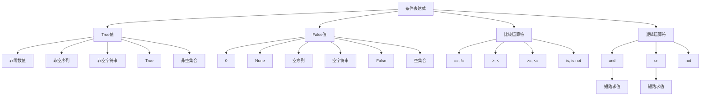
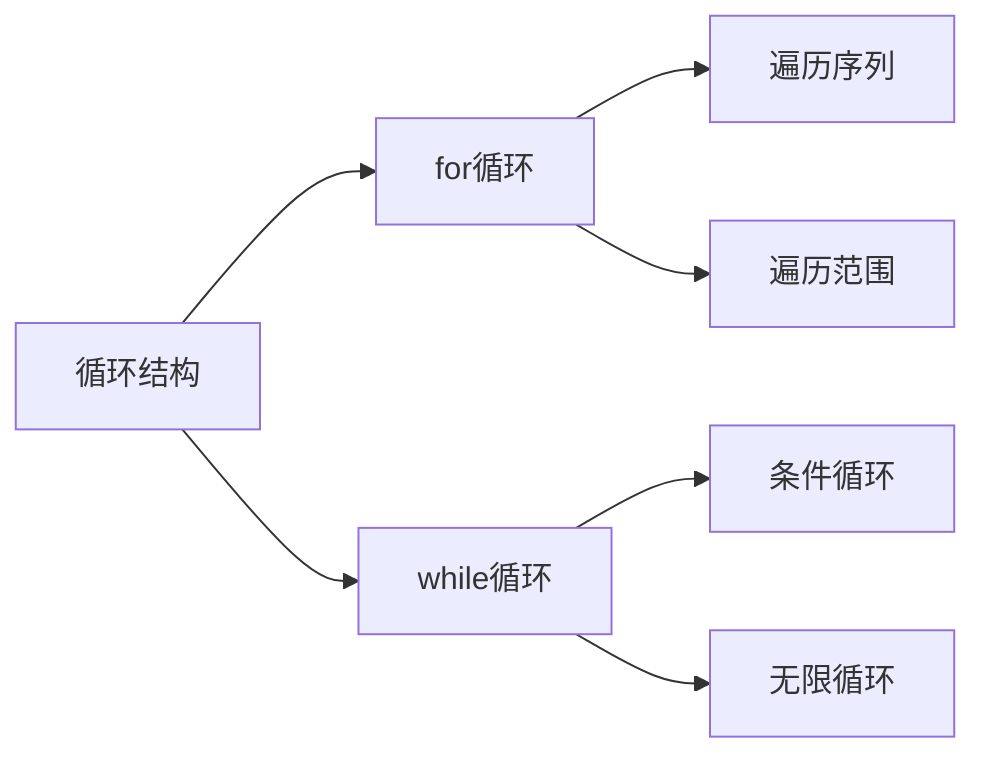

# 第3章 选择与循环

## 3.1 条件表达式

### 条件表达式基础



条件表达式是Python编程中控制程序流程的基础，它们的计算结果为布尔值（True或False）。Python的条件判断有以下特点：

### 1. 布尔值转换规则

在Python中，几乎所有的对象都可以被解释为布尔值：

- **True值**：以下值在条件判断中被视为True
  - 非零数值：任何非零的整数、浮点数
  - 非空序列：包含元素的列表、元组、字符串等
  - 非空集合：包含元素的集合、字典等
  - 布尔值True
  - 大多数其他对象

- **False值**：以下值在条件判断中被视为False
  - 数值0（整数0、浮点数0.0）
  - None
  - 空序列：空列表[]、空元组()、空字符串""
  - 空集合：空字典{}、空集合set()
  - 布尔值False

### 2. 比较运算符

- **相等比较**：`==`（相等）、`!=`（不相等）
- **大小比较**：`>`（大于）、`<`（小于）、`>=`（大于等于）、`<=`（小于等于）
- **身份比较**：`is`（是同一对象）、`is not`（不是同一对象）
- **成员测试**：`in`（在序列中）、`not in`（不在序列中）

### 3. 逻辑运算符

- **and**：逻辑与，当所有条件都为True时结果为True
- **or**：逻辑或，当任一条件为True时结果为True
- **not**：逻辑非，取反操作

### 4. 短路求值

- **and的短路求值**：如果第一个操作数为False，不再评估第二个操作数
- **or的短路求值**：如果第一个操作数为True，不再评估第二个操作数

这种灵活的布尔评估机制使Python代码更加简洁，但也需要注意潜在的隐式转换问题。

Python中的条件表达式用于控制程序流程，它们的计算结果为布尔值（True或False）。Python的条件判断有以下特点：

- **隐式布尔转换**：Python会自动将各种类型的值转换为布尔值
  - **True值**：非零数值、非空序列、非空字符串等
  - **False值**：0、None、空序列、空字符串等

- **比较运算符**：`==`、`!=`、`>`、`<`、`>=`、`<=`用于比较值
- **逻辑运算符**：`and`、`or`、`not`用于组合条件

这种灵活的布尔评估机制使Python代码更加简洁，但也需要注意潜在的隐式转换问题。

### 条件表达式示例

```python
# 基本比较
x = 10
y = 20
print(x > y)   # False
print(x < y)   # True
print(x == y)  # False
print(x != y)  # True

# 复合条件
age = 25
has_ticket = True
can_enter = age >= 18 and has_ticket
print(can_enter)  # True

# 特殊值判断
value = None
if value is None:
    print("值为None")

# 序列判断
list_empty = []
if not list_empty:
    print("列表为空")
```

## 3.2 选择结构

Python的选择结构允许程序根据条件执行不同的代码路径，是控制程序流程的基本方式。Python提供了几种灵活的选择结构，可以满足从简单到复杂的各种条件判断需求。

### 1. 单分支结构（if）

最基本的选择结构，当条件为真时执行特定代码块，否则跳过：

```python
# 单分支结构
score = 85
if score >= 60:
    print("及格")
```

**特点**：
- 只有一个执行路径（条件为真时）
- 使用缩进来定义代码块（Python的特色）
- 适用于简单的条件检查，如验证输入、权限检查等

### 2. 双分支结构（if-else）

根据条件选择两个代码块之一执行：

```python
# 双分支结构
age = 20
if age >= 18:
    print("成年人")
else:
    print("未成年人")
```

**特点**：
- 提供两个互斥的执行路径
- 无论条件真假，总会执行其中一个代码块
- 适用于需要二选一的场景，如用户验证成功/失败处理

### 3. 多分支结构（if-elif-else）

依次检查多个条件，执行第一个为真的条件对应的代码块：

```python
# 工作日判断
day = 3  # 1-7表示周一到周日
if day == 6 or day == 7:
    print("周末")
elif 1 <= day <= 5:
    print("工作日")
else:
    print("无效输入")
```

**特点**：
- 提供多个可能的执行路径
- 条件按顺序评估，只执行第一个为真的条件对应的代码块
- `else`子句是可选的，用于处理所有条件都为假的情况
- 适用于多种可能性的选择，如成绩等级划分、菜单选择等

### 4. 条件表达式（三元操作符）

Python的条件表达式提供了一种简洁的方式来编写简单的if-else结构：

```python
# 判断数字是否为正数
num = 10
result = "正数" if num > 0 else "非正数"
print(result)  # 输出: 正数

# 判断成绩是否及格
score = 75
status = "及格" if score >= 60 else "不及格"
print(status)  # 输出: 及格
```

**特点**：
- 简洁的单行形式
- 返回一个值，而不是执行代码块
- 适用于简单的条件赋值场景

## 3.3 循环结构

### 循环结构类型



Python提供了两种主要的循环结构，用于重复执行代码块：

- **for循环**：主要用于遍历序列（如列表、元组、字符串等）或可迭代对象
  - 语法简洁，适合已知迭代次数的场景
  - 自动处理迭代过程，无需手动更新计数器
  - 通过`range()`函数可以生成数字序列进行遍历
  - 可以使用`enumerate()`函数同时获取索引和值

- **while循环**：基于条件表达式控制循环执行
  - 适合未知迭代次数的场景
  - 需要手动控制循环条件的变化
  - 可以实现无限循环（使用`while True`）
  - 更灵活但也更容易出错（如忘记更新条件导致无限循环）

选择合适的循环结构可以使代码更加简洁高效。通常，当需要遍历序列或已知迭代次数时使用for循环，当需要基于条件控制循环时使用while循环。

### for循环示例

```python
# 遍历列表
fruits = ['apple', 'banana', 'orange']
for fruit in fruits:
    print(fruit)

# 遍历字符串
for char in 'Python':
    print(char)

# 遍历范围
for i in range(5):
    print(i)  # 0到4

# 带索引的遍历
for index, value in enumerate(fruits):
    print(f"{index}: {value}")

# 遍历字典
student = {'name': 'Alice', 'age': 20}
for key, value in student.items():
    print(f"{key}: {value}")
```

### while循环示例

```python
# 基本while循环
count = 0
while count < 5:
    print(count)
    count += 1

# 条件控制循环
num = int(input("输入一个正数："))
while num <= 0:
    num = int(input("请重新输入一个正数："))

# 无限循环
while True:
    response = input("输入'quit'退出：")
    if response == 'quit':
        break
```

## 3.4 循环控制

### 循环控制语句

Python提供了三种主要的循环控制语句，用于更精细地控制循环行为：

- **break语句**：立即终止整个循环，跳出循环体
  - 用于在满足特定条件时提前结束循环
  - 常用于查找特定元素或满足条件后不再需要继续循环的场景
  - 在嵌套循环中，只会跳出最内层的循环

- **continue语句**：跳过当前迭代，直接进入下一次迭代
  - 用于在特定条件下跳过某些处理步骤
  - 不会终止整个循环，只影响当前迭代
  - 可以用来过滤不需要处理的元素

- **else子句**：当循环正常完成（不是通过break退出）时执行
  - 用于在循环完成后执行特定操作
  - 如果循环通过break退出，else子句不会执行
  - 可以用来确认是否找到了特定元素

这些控制语句使Python循环更加灵活强大，能够处理各种复杂的循环逻辑。

### 控制语句示例

```python
# break示例
for i in range(1, 11):
    if i == 5:
        break
    print(i)

# continue示例
for i in range(1, 6):
    if i == 3:
        continue
    print(i)

# else子句示例
for i in range(5):
    print(i)
else:
    print("循环正常完成")

# break与else
for i in range(5):
    if i == 3:
        break
    print(i)
else:
    print("这句不会执行")
```

## 3.5 循环应用

### 实际应用示例

#### 求和计算
```python
# 求和计算
sum = 0
for i in range(1, 101):
    sum += i
print(f"1到100的和：{sum}")
```
#### 阶乘计算
```python
# 阶乘计算
num = 5
factorial = 1
for i in range(1, num + 1):
    factorial *= i
print(f"{num}的阶乘：{factorial}")
```
#### 素数判断
```python
# 素数判断
num = 17
is_prime = True
for i in range(2, int(num ** 0.5) + 1):
    if num % i == 0:
        is_prime = False
        break
print(f"{num}是否为素数：{is_prime}")
```
#### 九九乘法表
```python
# 九九乘法表
for i in range(1, 10):
    for j in range(1, i + 1):
        print(f"{j}×{i}={i*j}", end='\t')
    print()
```
