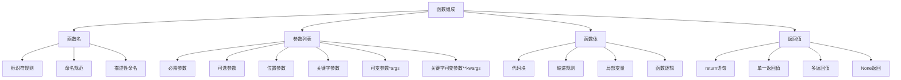
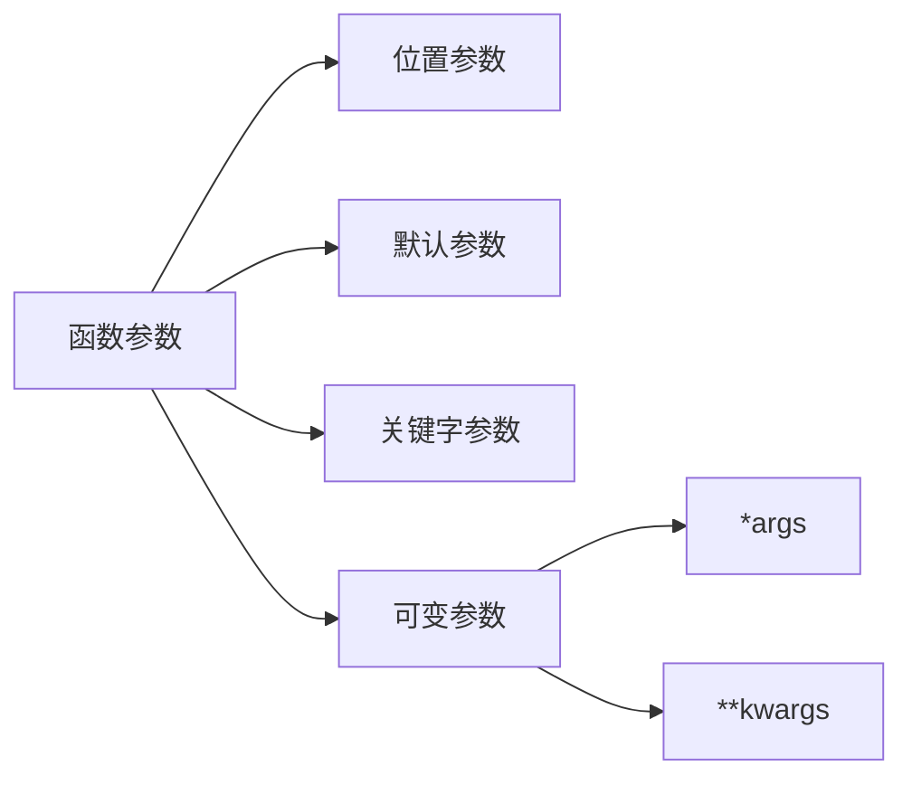
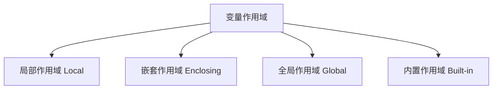

# 第5章 函数设计与使用

## 5.1 函数基础

### 函数的组成部分



函数是Python中最基本的代码组织单元，由以下几个关键部分组成：

### 1. 函数名
- **标识符规则**：遵循Python变量命名规则，由字母、数字和下划线组成，不能以数字开头
- **命名规范**：通常使用小写字母和下划线（snake_case），如`calculate_area`
- **描述性命名**：函数名应清晰描述函数的功能，如`get_user_data`、`calculate_total_price`

### 2. 参数列表
- **必需参数**：调用函数时必须提供的参数
- **可选参数**：具有默认值的参数，调用时可以省略
- **位置参数**：按位置顺序传递的参数
- **关键字参数**：按参数名称传递的参数
- **可变位置参数**：使用`*args`接收任意数量的位置参数
- **可变关键字参数**：使用`**kwargs`接收任意数量的关键字参数

### 3. 函数体
- **代码块**：实现函数功能的语句集合
- **缩进规则**：Python使用缩进来定义代码块，通常是4个空格
- **局部变量**：函数内部定义的变量，只在函数内部可见
- **函数逻辑**：实现函数功能的算法和操作

### 4. 返回值
- **return语句**：用于从函数返回值，可以返回任何类型的数据
- **单一返回值**：返回单个值
- **多返回值**：返回多个值（实际上是返回一个元组）
- **None返回**：如果没有return语句，或return后没有表达式，函数返回None

### 函数定义与调用

```python
# 基本函数定义
def greet(name):
    """打招呼函数"""
    return f"Hello, {name}!"

# 函数调用
result = greet("Python")
print(result)  # Hello, Python!

# 多返回值
def get_coordinates():
    return 3, 4

x, y = get_coordinates()
print(f"x: {x}, y: {y}")  # x: 3, y: 4

# 文档字符串
def calculate_area(length, width):
    """计算矩形面积
    
    Args:
        length: 长度
        width: 宽度
    
    Returns:
        float: 矩形面积
    """
    return length * width

# 查看函数文档
print(calculate_area.__doc__)
```

## 5.2 函数参数

### 参数类型



### 参数示例

```python
# 位置参数
def power(base, exponent):
    return base ** exponent

print(power(2, 3))  # 8

# 默认参数
def greet(name, greeting="Hello"):
    return f"{greeting}, {name}!"

print(greet("Python"))        # Hello, Python!
print(greet("Python", "Hi"))  # Hi, Python!

# 关键字参数
def create_user(name, age, city):
    return f"User {name} is {age} years old from {city}"

print(create_user(age=25, city="Beijing", name="Alice"))

# 可变位置参数
def sum_numbers(*numbers):
    return sum(numbers)

print(sum_numbers(1, 2, 3, 4, 5))  # 15

# 可变关键字参数
def print_info(**info):
    for key, value in info.items():
        print(f"{key}: {value}")

print_info(name="Alice", age=25, city="Beijing")

# 混合使用参数
def complex_function(a, b, *args, **kwargs):
    print(f"a = {a}")
    print(f"b = {b}")
    print(f"args = {args}")
    print(f"kwargs = {kwargs}")

complex_function(1, 2, 3, 4, x=5, y=6)
```

### 参数传递机制

| 参数类型 | 传递方式 | 示例 |
|----------|----------|------|
| 不可变对象 | 值传递 | 数字、字符串、元组 |
| 可变对象 | 引用传递 | 列表、字典、集合 |

```python
# 不可变对象传递
def modify_number(n):
    n += 1
    return n

x = 10
y = modify_number(x)
print(x)  # 10（原值不变）
print(y)  # 11

# 可变对象传递
def modify_list(lst):
    lst.append(4)
    return lst

numbers = [1, 2, 3]
result = modify_list(numbers)
print(numbers)  # [1, 2, 3, 4]（原列表被修改）
print(result)   # [1, 2, 3, 4]
```

## 5.3 函数返回值

### 返回值类型

```python
# 单一返回值
def square(n):
    return n ** 2

# 多返回值
def divide(a, b):
    quotient = a // b
    remainder = a % b
    return quotient, remainder

# 返回None
def greet(name):
    print(f"Hello, {name}!")
    # 隐式返回None

# 返回函数
def get_operation(operator):
    def add(a, b): return a + b
    def subtract(a, b): return a - b
    def multiply(a, b): return a * b
    def divide(a, b): return a / b
    
    operations = {
        '+': add,
        '-': subtract,
        '*': multiply,
        '/': divide
    }
    return operations.get(operator)
```

## 5.4 变量作用域

### 作用域类型



### 作用域示例

```python
# 全局变量
global_var = 100

def outer_function():
    # 嵌套作用域变量
    enclosing_var = 200
    
    def inner_function():
        # 局部变量
        local_var = 300
        print(f"Local: {local_var}")
        print(f"Enclosing: {enclosing_var}")
        print(f"Global: {global_var}")
    
    inner_function()

# global关键字
def modify_global():
    global global_var
    global_var = 150

# nonlocal关键字
def outer():
    x = 1
    def inner():
        nonlocal x
        x = 2
    inner()
    print(x)  # 2
```

## 5.5 lambda表达式

### lambda表达式用法

```python
# 基本lambda表达式
square = lambda x: x ** 2
print(square(5))  # 25

# 在函数中使用lambda
points = [(1, 2), (4, 1), (2, 3)]
sorted_points = sorted(points, key=lambda p: p[1])
print(sorted_points)

# 结合map使用
numbers = [1, 2, 3, 4, 5]
squares = list(map(lambda x: x**2, numbers))
print(squares)

# 结合filter使用
even_numbers = list(filter(lambda x: x % 2 == 0, numbers))
print(even_numbers)
```

## 5.6 函数式编程

### 高阶函数

```python
# map函数
def square(x):
    return x ** 2

numbers = [1, 2, 3, 4, 5]
squared = list(map(square, numbers))
print(squared)  # [1, 4, 9, 16, 25]

# filter函数
def is_even(x):
    return x % 2 == 0

filtered = list(filter(is_even, numbers))
print(filtered)  # [2, 4]

# reduce函数
from functools import reduce

def multiply(x, y):
    return x * y

product = reduce(multiply, numbers)
print(product)  # 120

# 装饰器
def timing_decorator(func):
    from time import time
    def wrapper(*args, **kwargs):
        start = time()
        result = func(*args, **kwargs)
        end = time()
        print(f"{func.__name__} took {end - start} seconds")
        return result
    return wrapper

@timing_decorator
def slow_function():
    import time
    time.sleep(1)
    return "Done!"

print(slow_function())
```

### 函数编程最佳实践

| 原则 | 说明 | 示例 |
|------|------|------|
| 单一职责 | 函数只做一件事 | 数据处理和显示分离 |
| 参数验证 | 检查参数有效性 | 类型检查、范围验证 |
| 异常处理 | 优雅处理错误 | try-except结构 |
| 文档完备 | 清晰的文档字符串 | 参数说明、返回值说明 |
| 命名规范 | 见名知义 | 动词+名词组合 |

```python
# 函数设计示例
def calculate_bmi(weight, height):
    """计算BMI指数
    
    Args:
        weight (float): 体重（千克）
        height (float): 身高（米）
    
    Returns:
        float: BMI指数
    
    Raises:
        ValueError: 当输入参数非正数时
    """
    if not (weight > 0 and height > 0):
        raise ValueError("体重和身高必须为正数")
    
    try:
        bmi = weight / (height ** 2)
        return round(bmi, 2)
    except Exception as e:
        raise Exception(f"计算BMI时出错：{str(e)}")

# 使用示例
try:
    bmi = calculate_bmi(70, 1.75)
    print(f"BMI: {bmi}")
except ValueError as e:
    print(f"输入错误：{str(e)}")
except Exception as e:
    print(f"计算错误：{str(e)}")
```