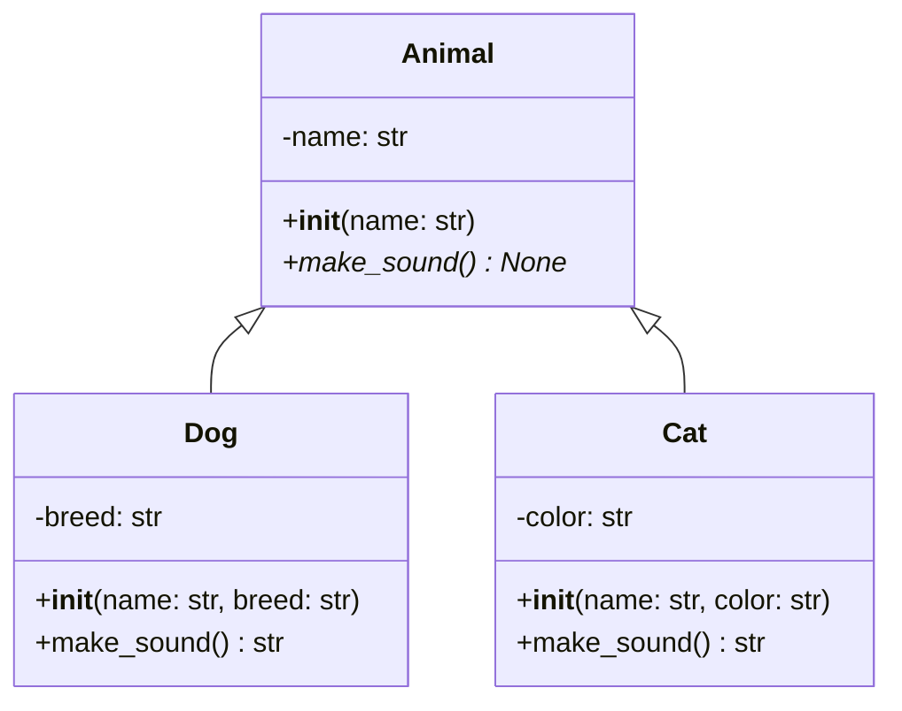

# 第6章 面向对象程序设计

## 6.1 面向对象基础

### 面向对象的基本概念

Python作为一种多范式编程语言，对面向对象编程提供了全面的支持。以下是面向对象编程的核心概念：

### 1. 类与对象

- **类（Class）**：是对象的蓝图或原型，定义了对象将具有的属性和方法
  - 属性：描述对象的特征或状态（数据）
  - 方法：描述对象的行为或功能（函数）
  - 构造方法：创建对象时自动调用的特殊方法（`__init__`）
  - 特殊方法：提供特定功能的内置方法（如`__str__`、`__repr__`等）

- **对象（Object）**：是类的实例，代表程序中的具体实体
  - 状态：对象当前的属性值
  - 行为：对象可以执行的操作
  - 标识：对象的唯一标识符（内存地址）

### 2. 面向对象的三大特性

- **封装（Encapsulation）**：
  - 将数据和方法捆绑在一起，形成一个独立的单元
  - 通过访问控制限制对内部数据的直接访问
  - 在Python中使用单下划线（`_`）和双下划线（`__`）前缀实现
  - 提供公共接口（方法）来操作内部数据

- **继承（Inheritance）**：
  - 允许一个类（子类）获取另一个类（父类）的属性和方法
  - 促进代码重用和建立类层次结构
  - Python支持单继承和多继承
  - 子类可以重写父类的方法，实现特定的行为

- **多态（Polymorphism）**：
  - 允许不同类的对象对同一消息做出响应
  - 同一操作作用于不同的对象，可以有不同的解释和实现
  - 在Python中通过方法重写和鸭子类型实现
  - 增强代码的灵活性和可扩展性

面向对象编程使代码更加模块化、可重用和易于维护，特别适合大型复杂系统的开发。
Python的动态特性和灵活的语法使其成为学习和应用面向对象概念的理想语言。

- **类**：是对象的蓝图或原型，定义了对象将具有的属性和方法
- **对象**：是类的实例，代表程序中的具体实体
- **属性**：描述对象的特征或状态
- **方法**：描述对象的行为或功能

### 类的定义与使用
```python
# 基本类定义
class Person:
    """人类的基本定义"""

    def __init__(self, name, age):
        """初始化方法"""
        self.name = name  # 实例属性
        self.age = age

    def introduce(self):
        """自我介绍方法"""
        return f"我叫{self.name}，今年{self.age}岁"

# 创建对象
person = Person("张三", 25)
print(person.introduce())

# 类属性与实例属性
class Student:
    school = "Python大学"  # 类属性

    def __init__(self, name):
        self.name = name  # 实例属性

# 访问属性
student = Student("李四")
print(Student.school)  # 访问类属性
print(student.name)    # 访问实例属性
```

## 6.2 类的特殊方法

### 常用特殊方法

| 方法 | 说明 | 调用时机 |
|------|------|----------|
| __init__ | 构造方法 | 创建对象时 |
| __str__ | 字符串表示 | str()函数 |
| __repr__ | 详细字符串表示 | repr()函数 |
| __len__ | 长度 | len()函数 |
| __call__ | 可调用对象 | 对象() |
| __getitem__ | 索引访问 | 对象[] |
| __setitem__ | 索引赋值 | 对象[] = 值 |

```python
class Book:
    def __init__(self, title, author, price):
        self.title = title
        self.author = author
        self.price = price

    def __str__(self):
        return f"{self.title} by {self.author}"

    def __repr__(self):
        return f"Book(title='{self.title}', author='{self.author}', price={self.price})"

    def __len__(self):
        return len(self.title)

    def __call__(self):
        return f"这是一本{self.title}的书"

# 使用特殊方法
book = Book("Python编程", "张三", 59.9)
print(str(book))      # 调用__str__
print(repr(book))     # 调用__repr__
print(len(book))      # 调用__len__
print(book())         # 调用__call__
```

## 6.3 继承与多态

### 继承关系

继承是面向对象编程中的一个核心概念，它允许一个类（子类）获取另一个类（父类）的属性和方法。通过继承：

- **代码重用**：子类可以重用父类中已定义的功能
- **层次结构**：可以创建类的层次结构，反映实体之间的关系
- **多态性**：子类可以重写父类的方法，提供特定的实现

在上图中，Dog和Cat类都继承自Animal类，它们共享Animal的属性和方法，同时各自添加了特定的属性和行为。

### 继承与多态示例


```python
class Animal:
    def __init__(self, name):
        self.name = name

    def make_sound(self):
        pass

class Dog(Animal):
    def __init__(self, name, breed):
        super().__init__(name)
        self.breed = breed

    def make_sound(self):
        return "汪汪！"

class Cat(Animal):
    def __init__(self, name, color):
        super().__init__(name)
        self.color = color

    def make_sound(self):
        return "喵喵！"

# 多态示例
def animal_sound(animal):
    return animal.make_sound()

dog = Dog("旺财", "金毛")
cat = Cat("咪咪", "白色")

print(animal_sound(dog))  # 汪汪！
print(animal_sound(cat))  # 喵喵！

# isinstance和issubclass
print(isinstance(dog, Animal))  # True
print(issubclass(Dog, Animal))  # True
```

## 6.4 封装与访问控制

### 封装的概念

封装是面向对象编程的三大特性之一（另外两个是继承和多态），它指的是将数据和操作数据的方法捆绑在一起，并对外部隐藏内部实现细节。

### 访问控制

Python中没有严格的私有属性，而是通过命名约定实现访问控制：

公有属性：直接命名，如 name

保护属性：单下划线开头，如 _age（约定私有，但可访问）

私有属性：双下划线开头，如 __id（触发名称修饰，变为 _类名__id）

#### 装饰器
装饰器是修改其他函数/方法行为的函数，常见用途：

@property：将方法转为属性访问

@属性.setter：定义属性的赋值逻辑

自定义装饰器：实现权限检查、日志记录等

#### 完整示例代码
```python
class Person:
    def __init__(self, name, age, id_num):
        self.name = name          # 公有属性
        self._age = age           # 保护属性（约定）
        self.__id = id_num        # 私有属性（名称修饰）

    # 自定义装饰器：记录属性访问
    @staticmethod
    def log_access(func):
        def wrapper(*args, **kwargs):
            print(f"[LOG] 访问属性: {func.__name__}")
            return func(*args, **kwargs)
        return wrapper

    # 自定义装饰器：验证年龄范围
    @staticmethod
    def validate_age(func):
        def wrapper(self, value):
            if not (0 <= value <= 150):
                raise ValueError("年龄必须在0-150之间")
            return func(self, value)
        return wrapper

    # 保护属性的访问器与修改器
    @property
    @log_access
    def age(self):
        return self._age

    @age.setter
    @validate_age
    def age(self, value):
        self._age = value

    # 私有属性的访问器与修改器（通过名称修饰访问）
    @property
    def id(self):
        return self.__id

    @id.setter
    def id(self, value):
        if not isinstance(value, int):
            raise TypeError("ID必须是整数")
        self.__id = value

# 使用示例
if __name__ == "__main__":
    p = Person("Alice", 30, 1001)

    # 访问公有属性
    print(f"姓名: {p.name}")      # 直接访问

    # 访问保护属性（通过装饰器）
    print(f"年龄: {p.age}")       # 触发@log_access
    p.age = 35                   # 触发@validate_age

    # 访问私有属性（通过属性装饰器）
    print(f"ID: {p.id}")
    p.id = 1002                  # 触发类型检查

    # 非法操作示例（会报错）
    try:
        p.age = 200              # 触发ValueError
    except ValueError as e:
        print(f"错误: {e}")

    try:
        p.id = "abc"             # 触发TypeError
    except TypeError as e:
        print(f"错误: {e}")

    # 直接访问私有属性（不推荐！）
    print(f"强制访问私有属性: {p._Person__id}")
```
## 6.6 类方法与静态方法

### 方法类型对比

| 方法类型 | 装饰器 | 第一个参数 | 使用场景 |
|----------|--------|------------|----------|
| 实例方法 | 无 | self | 操作实例属性 |
| 类方法 | @classmethod | cls | 操作类属性 |
| 静态方法 | @staticmethod | 无 | 工具方法 |

```python
class Date:
    def __init__(self, year, month, day):
        self.year = year
        self.month = month
        self.day = day

    @classmethod
    def from_string(cls, date_string):
        """从字符串创建日期对象"""
        year, month, day = map(int, date_string.split('-'))
        return cls(year, month, day)

    @staticmethod
    def is_valid_date(date_string):
        """验证日期字符串格式"""
        try:
            year, month, day = map(int, date_string.split('-'))
            return 1 <= month <= 12 and 1 <= day <= 31
        except:
            return False

    def __str__(self):
        return f"{self.year}-{self.month:02d}-{self.day:02d}"

# 使用示例
date1 = Date(2023, 12, 31)
date2 = Date.from_string("2023-12-31")  # 使用类方法
print(Date.is_valid_date("2023-13-31"))  # 使用静态方法
```
