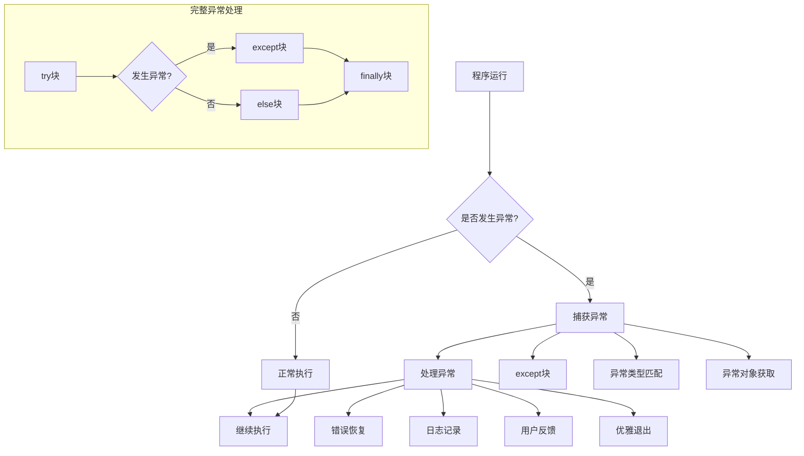
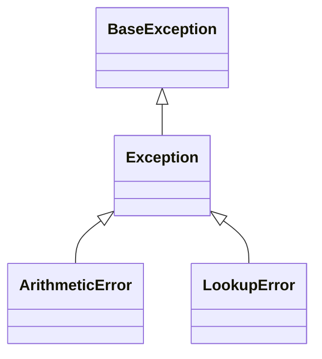
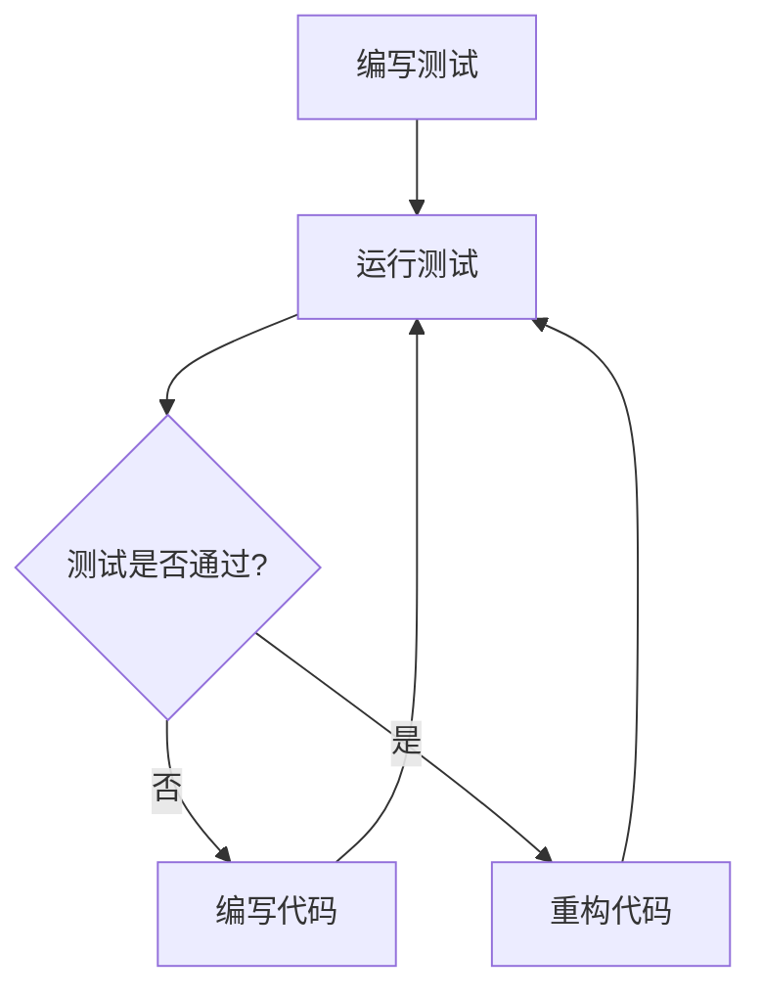

# 第8章 异常处理、程序调试与测试

## 8.1 异常处理基础

### 异常处理流程



异常处理是Python程序健壮性的关键部分，它允许程序在遇到错误时优雅地处理而不是直接崩溃。以下是Python异常处理的详细流程：

### 1. 程序运行与异常检测
- 程序正常执行代码
- Python解释器自动检测是否发生异常
- 如果没有异常，程序按正常路径执行
- 如果发生异常，程序进入异常处理流程

### 2. 捕获异常
- **except块**：使用`try-except`结构捕获可能的异常
- **异常类型匹配**：Python尝试将发生的异常与except语句中指定的异常类型匹配
- **异常对象获取**：可以通过`as`子句获取异常对象，访问异常详细信息

### 3. 处理异常
- **错误恢复**：尝试从错误状态恢复，如提供默认值或替代方案
- **日志记录**：记录异常信息，便于后续分析和调试
- **用户反馈**：向用户提供友好的错误信息
- **优雅退出**：如果无法恢复，确保程序能够正常关闭资源并退出

### 4. 完整的异常处理结构
- **try块**：包含可能引发异常的代码
- **except块**：捕获并处理特定类型的异常
- **else块**：当try块没有引发异常时执行
- **finally块**：无论是否发生异常都会执行，通常用于资源清理

使用结构化的异常处理可以使程序更加健壮，能够应对各种意外情况，同时保持代码的可读性和可维护性。

### Python异常层次结构



Python的异常系统采用层次结构设计，所有异常都继承自BaseException类：

- **BaseException**：所有内置异常的基类
- **Exception**：常规错误的基类，大多数异常都是它的子类
- **ArithmeticError**：数学计算错误的基类，如OverflowError、ZeroDivisionError等
- **LookupError**：查找错误的基类，如IndexError、KeyError等

这种层次结构使得异常处理更加灵活，可以通过捕获父类异常来处理多种类型的错误。

### 常见异常类型

| 异常类型 | 描述 | 示例场景 |
|----------|------|----------|
| SyntaxError | 语法错误 | 代码格式错误 |
| NameError | 名称未定义 | 使用未定义的变量 |
| TypeError | 类型错误 | 操作类型不匹配 |
| ValueError | 值错误 | 值不符合要求 |
| IndexError | 索引错误 | 访问越界索引 |
| KeyError | 键错误 | 访问不存在的键 |
| FileNotFoundError | 文件未找到 | 打开不存在的文件 |
| ZeroDivisionError | 除零错误 | 除数为零 |

## 8.2 异常处理结构

### 基本异常处理

```python
# try-except 结构
try:
    x = int(input("请输入一个数字："))
    result = 10 / x
    print(f"结果是：{result}")
except ValueError:
    print("输入必须是数字！")
except ZeroDivisionError:
    print("除数不能为零！")

# 捕获多个异常
try:
    # 可能产生异常的代码
    pass
except (TypeError, ValueError) as e:
    print(f"发生错误：{str(e)}")

# 捕获所有异常
try:
    # 可能产生异常的代码
    pass
except Exception as e:
    print(f"发生未知错误：{str(e)}")
```

### 完整异常处理结构

```python
try:
    file = open("example.txt", "r")
    # 文件操作
except FileNotFoundError:
    print("文件不存在")
except PermissionError:
    print("没有权限访问文件")
else:
    print("文件操作成功")
    # 只在没有异常时执行的代码
finally:
    file.close()  # 总是执行的清理代码
```

### 自定义异常

```python
class CustomError(Exception):
    """自定义异常类"""
    def __init__(self, message):
        self.message = message
        super().__init__(self.message)

# 使用自定义异常
def validate_age(age):
    if age < 0:
        raise CustomError("年龄不能为负数")
    if age > 150:
        raise CustomError("年龄超出正常范围")
    return age

# 异常处理
try:
    age = validate_age(-5)
except CustomError as e:
    print(f"错误：{e.message}")
```

## 8.3 断言与上下文管理

### 断言使用

```python
def calculate_square_root(n):
    assert n >= 0, "输入必须是非负数"
    return n ** 0.5

# 使用断言进行参数验证
def process_list(lst):
    assert isinstance(lst, list), "参数必须是列表类型"
    assert len(lst) > 0, "列表不能为空"
    return sum(lst)
```

### 上下文管理器

```python
# 自定义上下文管理器
class FileManager:
    def __init__(self, filename, mode):
        self.filename = filename
        self.mode = mode
        self.file = None
    
    def __enter__(self):
        self.file = open(self.filename, self.mode)
        return self.file
    
    def __exit__(self, exc_type, exc_val, exc_tb):
        if self.file:
            self.file.close()

# 使用上下文管理器
with FileManager('test.txt', 'w') as f:
    f.write('Hello, World!')
```

## 8.4 调试技巧

### print调试

```python
def complex_calculation(a, b):
    print(f"输入参数：a={a}, b={b}")  # 调试信息
    
    result = a * b
    print(f"中间结果：{result}")  # 调试信息
    
    final_result = result ** 2
    print(f"最终结果：{final_result}")  # 调试信息
    
    return final_result
```

### 使用pdb调试

```python
import pdb

def buggy_function():
    x = 1
    y = 0
    pdb.set_trace()  # 设置断点
    z = x / y  # 这里会产生错误
    return z

# pdb常用命令
# n(next) - 执行下一行
# s(step) - 步入函数
# c(continue) - 继续执行
# p variable - 打印变量值
# l(list) - 显示当前位置的代码
# q(quit) - 退出调试器
```

## 8.5 单元测试

### 基本测试用例

```python
import unittest

# 被测试的函数
def add(a, b):
    return a + b

class TestAddFunction(unittest.TestCase):
    def test_add_positive_numbers(self):
        self.assertEqual(add(1, 2), 3)
    
    def test_add_negative_numbers(self):
        self.assertEqual(add(-1, -2), -3)
    
    def test_add_zero(self):
        self.assertEqual(add(5, 0), 5)

if __name__ == '__main__':
    unittest.main()
```

### 测试夹具

```python
class TestWithSetup(unittest.TestCase):
    def setUp(self):
        """每个测试方法前执行"""
        self.numbers = [1, 2, 3]
    
    def tearDown(self):
        """每个测试方法后执行"""
        self.numbers = None
    
    def test_list_operations(self):
        self.numbers.append(4)
        self.assertEqual(len(self.numbers), 4)
        self.assertEqual(sum(self.numbers), 10)
```

### 高级测试技巧

```python
from unittest.mock import Mock, patch

class TestWithMock(unittest.TestCase):
    def test_mock_function(self):
        # 创建模拟对象
        mock_func = Mock(return_value=42)
        result = mock_func()
        self.assertEqual(result, 42)
        mock_func.assert_called_once()
    
    @patch('module_name.function_name')
    def test_with_patch(self, mock_function):
        mock_function.return_value = 'mocked'
        # 测试使用被模拟的函数的代码
        pass

# 参数化测试
class TestParameterized(unittest.TestCase):
    def test_multiple_inputs(self):
        test_cases = [
            (2, 3, 5),
            (-1, 1, 0),
            (0, 0, 0)
        ]
        for a, b, expected in test_cases:
            with self.subTest(a=a, b=b):
                self.assertEqual(add(a, b), expected)
```

## 8.6 测试驱动开发(TDD)

### TDD流程



### TDD示例

```python
# 先编写测试
class TestCalculator(unittest.TestCase):
    def test_add(self):
        calc = Calculator()
        self.assertEqual(calc.add(2, 3), 5)
    
    def test_subtract(self):
        calc = Calculator()
        self.assertEqual(calc.subtract(5, 3), 2)

# 然后实现代码
class Calculator:
    def add(self, a, b):
        return a + b
    
    def subtract(self, a, b):
        return a - b
```

## 8.7 性能分析与优化

### 使用cProfile进行性能分析

```python
import cProfile

def slow_function():
    total = 0
    for i in range(1000000):
        total += i
    return total

# 性能分析
cProfile.run('slow_function()')
```

### 性能优化技巧

```python
# 1. 使用生成器节省内存
def number_generator(n):
    for i in range(n):
        yield i

# 2. 列表推导式替代循环
squares = [x**2 for x in range(10)]

# 3. 使用适当的数据结构
from collections import defaultdict
word_count = defaultdict(int)

# 4. 避免频繁的字符串拼接
parts = []
for i in range(100):
    parts.append(str(i))
result = ''.join(parts)  # 比 += 效率高
```