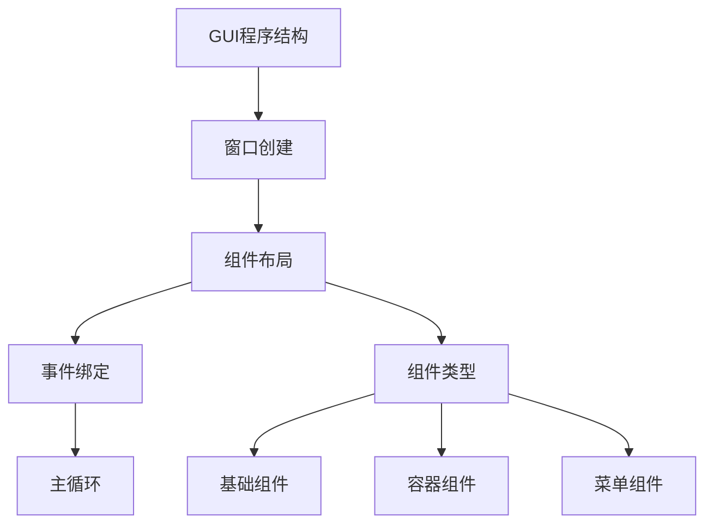
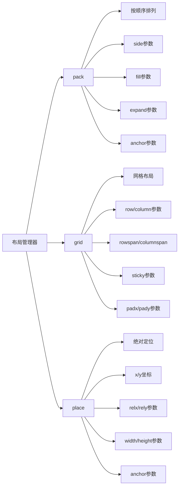

# 第9章 GUI编程

## 9.1 tkinter基础

### GUI编程概述



### tkinter基本组件

| 组件类型 | 类名 | 用途 |
|----------|------|------|
| 标签 | Label | 显示文本或图像 |
| 按钮 | Button | 触发动作 |
| 输入框 | Entry | 单行文本输入 |
| 文本框 | Text | 多行文本输入 |
| 列表框 | Listbox | 选择列表项 |
| 单选框 | Radiobutton | 单选 |
| 复选框 | Checkbutton | 多选 |
| 菜单 | Menu | 下拉菜单 |
| 框架 | Frame | 组件容器 |

### 基本窗口创建

```python
import tkinter as tk
from tkinter import ttk

class MainWindow:
    def __init__(self):
        self.root = tk.Tk()
        self.root.title("My First GUI")
        self.root.geometry("400x300")
        
        # 创建组件
        self.label = tk.Label(self.root, text="Hello, tkinter!")
        self.label.pack()
        
        self.button = tk.Button(self.root, text="Click Me!", command=self.button_click)
        self.button.pack()
    
    def button_click(self):
        print("Button clicked!")
    
    def run(self):
        self.root.mainloop()

if __name__ == '__main__':
    app = MainWindow()
    app.run()
```

## 9.2 布局管理

### 布局管理器



tkinter提供了三种主要的布局管理器，每种都有其特定的用途和优势：

### 1. pack布局管理器
- **基本原理**：按照添加顺序将组件打包到父容器中
- **主要参数**：
  - `side`：指定组件的放置方向（`'top'`, `'bottom'`, `'left'`, `'right'`）
  - `fill`：指定组件填充方向（`'x'`, `'y'`, `'both'`, `'none'`）
  - `expand`：是否允许组件扩展占用额外空间（`True`/`False`）
  - `anchor`：组件在分配空间内的定位点（`'n'`, `'s'`, `'e'`, `'w'`, `'ne'`等）
- **适用场景**：
  - 简单的界面布局，如工具栏、按钮栏
  - 组件需要按照一定顺序排列的情况
  - 自适应大小的界面

### 2. grid布局管理器
- **基本原理**：将父容器划分为网格，通过行列坐标放置组件
- **主要参数**：
  - `row`/`column`：指定组件放置的行列位置
  - `rowspan`/`columnspan`：指定组件跨越的行数/列数
  - `sticky`：组件在网格中的对齐方式（`'n'`, `'s'`, `'e'`, `'w'`或组合）
  - `padx`/`pady`：组件与网格边缘的水平/垂直间距
- **适用场景**：
  - 表单界面
  - 需要精确控制组件位置的复杂界面
  - 类似表格的数据展示

### 3. place布局管理器
- **基本原理**：通过绝对或相对坐标精确定位组件
- **主要参数**：
  - `x`/`y`：组件左上角的绝对坐标
  - `relx`/`rely`：组件左上角的相对坐标（0.0到1.0）
  - `width`/`height`：组件的宽度/高度
  - `relwidth`/`relheight`：相对于父容器的宽度/高度比例
  - `anchor`：组件的定位锚点
- **适用场景**：
  - 需要精确定位的特殊界面
  - 绝对位置不变的固定布局
  - 自定义绘图或动画界面

选择合适的布局管理器对于创建美观、响应式的GUI界面至关重要。通常，grid布局是最灵活的选择，适用于大多数复杂界面；pack布局适合简单的线性排列；place布局则用于需要精确控制的特殊情况。

### 布局示例

```python
# pack布局
class PackLayoutDemo:
    def __init__(self):
        self.root = tk.Tk()
        self.root.title("Pack Layout Demo")
        
        # 顶部按钮
        tk.Button(self.root, text="Top").pack(side="top")
        # 底部按钮
        tk.Button(self.root, text="Bottom").pack(side="bottom")
        # 左侧按钮
        tk.Button(self.root, text="Left").pack(side="left")
        # 右侧按钮
        tk.Button(self.root, text="Right").pack(side="right")

# grid布局
class GridLayoutDemo:
    def __init__(self):
        self.root = tk.Tk()
        self.root.title("Grid Layout Demo")
        
        # 创建标签和输入框
        tk.Label(self.root, text="用户名：").grid(row=0, column=0)
        tk.Entry(self.root).grid(row=0, column=1)
        
        tk.Label(self.root, text="密码：").grid(row=1, column=0)
        tk.Entry(self.root, show="*").grid(row=1, column=1)
        
        tk.Button(self.root, text="登录").grid(row=2, column=0, columnspan=2)

# place布局
class PlaceLayoutDemo:
    def __init__(self):
        self.root = tk.Tk()
        self.root.title("Place Layout Demo")
        
        # 绝对定位
        tk.Button(self.root, text="Button 1").place(x=10, y=10)
        tk.Button(self.root, text="Button 2").place(x=100, y=100)
```

## 9.3 事件处理

### 事件类型

| 事件 | 描述 | 示例 |
|------|------|------|
| <Button-1> | 鼠标左键点击 | widget.bind('<Button-1>', handler) |
| <Button-3> | 鼠标右键点击 | widget.bind('<Button-3>', handler) |
| <KeyPress> | 键盘按键 | widget.bind('<KeyPress>', handler) |
| <Return> | 回车键 | widget.bind('<Return>', handler) |
| <Motion> | 鼠标移动 | widget.bind('<Motion>', handler) |

### 事件处理示例

```python
class EventDemo:
    def __init__(self):
        self.root = tk.Tk()
        self.root.title("Event Demo")
        
        self.canvas = tk.Canvas(self.root, width=300, height=200)
        self.canvas.pack()
        
        # 绑定事件
        self.canvas.bind('<Button-1>', self.left_click)
        self.canvas.bind('<B1-Motion>', self.drag)
        self.canvas.bind('<ButtonRelease-1>', self.release)
    
    def left_click(self, event):
        self.last_x = event.x
        self.last_y = event.y
    
    def drag(self, event):
        self.canvas.create_line(self.last_x, self.last_y,
                               event.x, event.y)
        self.last_x = event.x
        self.last_y = event.y
    
    def release(self, event):
        print("Drawing finished")
```

## 9.4 高级组件

### 对话框

```python
from tkinter import messagebox, filedialog

class DialogDemo:
    def __init__(self):
        self.root = tk.Tk()
        
        # 消息框
        tk.Button(self.root, text="显示信息",
                  command=self.show_info).pack()
        tk.Button(self.root, text="显示警告",
                  command=self.show_warning).pack()
        tk.Button(self.root, text="显示错误",
                  command=self.show_error).pack()
        
        # 文件对话框
        tk.Button(self.root, text="打开文件",
                  command=self.open_file).pack()
        tk.Button(self.root, text="保存文件",
                  command=self.save_file).pack()
    
    def show_info(self):
        messagebox.showinfo("信息", "这是一条信息")
    
    def show_warning(self):
        messagebox.showwarning("警告", "这是一条警告")
    
    def show_error(self):
        messagebox.showerror("错误", "这是一条错误")
    
    def open_file(self):
        filename = filedialog.askopenfilename()
        if filename:
            print(f"打开文件：{filename}")
    
    def save_file(self):
        filename = filedialog.asksaveasfilename()
        if filename:
            print(f"保存文件：{filename}")
```

## 9.5 实际应用案例

### 简单计算器

```python
class Calculator:
    def __init__(self):
        self.root = tk.Tk()
        self.root.title("计算器")
        
        # 显示框
        self.display = tk.Entry(self.root, width=35, justify="right")
        self.display.grid(row=0, column=0, columnspan=4, padx=5, pady=5)
        
        # 按钮布局
        buttons = [
            '7', '8', '9', '/',
            '4', '5', '6', '*',
            '1', '2', '3', '-',
            '0', '.', '=', '+'
        ]
        
        row = 1
        col = 0
        for button in buttons:
            cmd = lambda x=button: self.click(x)
            tk.Button(self.root, text=button, width=5,
                      command=cmd).grid(row=row, column=col)
            col += 1
            if col > 3:
                col = 0
                row += 1
    
    def click(self, key):
        if key == '=':
            try:
                result = eval(self.display.get())
                self.display.delete(0, tk.END)
                self.display.insert(tk.END, str(result))
            except:
                self.display.delete(0, tk.END)
                self.display.insert(tk.END, "Error")
        else:
            self.display.insert(tk.END, key)

# 运行计算器
if __name__ == '__main__':
    calc = Calculator()
    calc.root.mainloop()
```

### 文本编辑器

```python
class TextEditor:
    def __init__(self):
        self.root = tk.Tk()
        self.root.title("文本编辑器")
        
        # 创建菜单栏
        self.create_menu()
        
        # 创建文本框
        self.text = tk.Text(self.root)
        self.text.pack(expand=True, fill='both')
        
        # 创建滚动条
        scrollbar = tk.Scrollbar(self.text)
        scrollbar.pack(side=tk.RIGHT, fill=tk.Y)
        
        # 连接文本框和滚动条
        self.text.config(yscrollcommand=scrollbar.set)
        scrollbar.config(command=self.text.yview)
    
    def create_menu(self):
        menubar = tk.Menu(self.root)
        
        # 文件菜单
        filemenu = tk.Menu(menubar, tearoff=0)
        filemenu.add_command(label="新建", command=self.new_file)
        filemenu.add_command(label="打开", command=self.open_file)
        filemenu.add_command(label="保存", command=self.save_file)
        filemenu.add_separator()
        filemenu.add_command(label="退出", command=self.root.quit)
        menubar.add_cascade(label="文件", menu=filemenu)
        
        # 编辑菜单
        editmenu = tk.Menu(menubar, tearoff=0)
        editmenu.add_command(label="剪切", command=lambda: self.text.event_generate("<<Cut>>"))
        editmenu.add_command(label="复制", command=lambda: self.text.event_generate("<<Copy>>"))
        editmenu.add_command(label="粘贴", command=lambda: self.text.event_generate("<<Paste>>"))
        menubar.add_cascade(label="编辑", menu=editmenu)
        
        self.root.config(menu=menubar)
    
    def new_file(self):
        self.text.delete(1.0, tk.END)
    
    def open_file(self):
        file = filedialog.askopenfile(mode='r')
        if file:
            content = file.read()
            self.text.delete(1.0, tk.END)
            self.text.insert(1.0, content)
            file.close()
    
    def save_file(self):
        file = filedialog.asksaveasfile(mode='w')
        if file:
            content = self.text.get(1.0, tk.END)
            file.write(content)
            file.close()

# 运行文本编辑器
if __name__ == '__main__':
    editor = TextEditor()
    editor.root.mainloop()
```